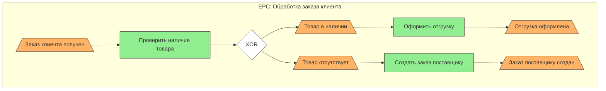
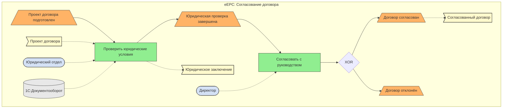
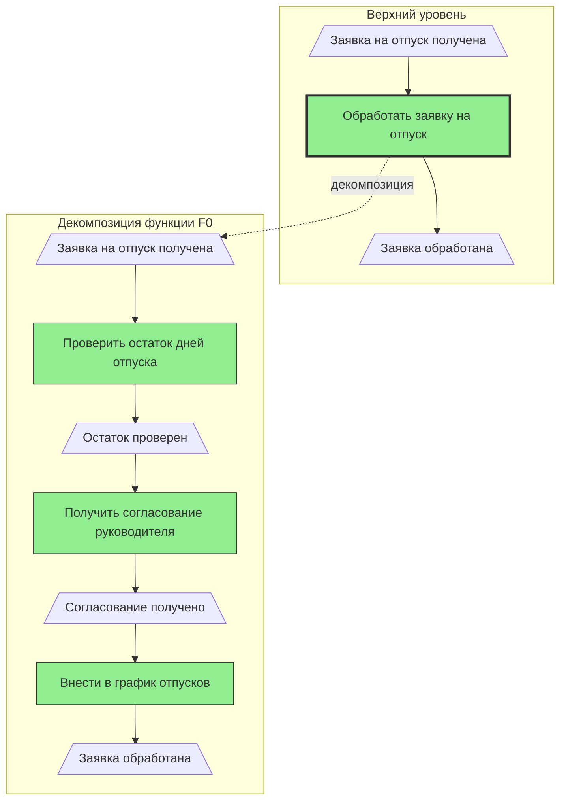

# Бизнес-функция в понимании профессора August-Wilhelm Scheer (ARIS/EPC)

## Оглавление
1. [Введение](#введение)
2. [Определение функции по Scheer](#определение-функции-по-scheer)
3. [Из чего состоит бизнес-функция](#из-чего-состоит-бизнес-функция)
4. [Сравнение с другими подходами](#сравнение-с-другими-подходами)
5. [Примеры: что является и что не является бизнес-функцией](#примеры-что-является-и-что-не-является-бизнес-функцией)
6. [Функция vs Процесс: дискуссия](#функция-vs-процесс-дискуссия)
7. [Математическая интерпретация EPC-функции](#математическая-интерпретация-epc-функции)
8. [Примеры EPC-диаграмм](#примеры-epc-диаграмм)
9. [Труды Scheer о функции](#труды-scheer-о-функции)
10. [Истоки терминологической проблемы](#истоки-терминологической-проблемы)
11. [Заключение](#заключение)
12. [Источники](#источники)

---

## Введение

Профессор **August-Wilhelm Scheer** (род. 1941) — немецкий учёный в области экономической информатики (Wirtschaftsinformatik), основатель и директор IDS Scheer AG, разработчик концепции **ARIS** (Architecture of Integrated Information Systems — Архитектура интегрированных информационных систем). В начале 1990-х годов в Саарбрюккенском университете (Universität des Saarlandes) под его руководством была разработана методология **EPK** (Ereignisgesteuerte Prozesskette) или **EPC** (Event-driven Process Chain — Событийно-управляемая цепочка процессов).

Понятие **«функция»** (Function, Funktion) является центральным элементом EPC-диаграмм и требует точного понимания в контексте бизнес-моделирования.

---

## Определение функции по Scheer

### Оригинальное определение (немецкий)

> **«Funktionen stellen Aktivitäten (Tätigkeiten) dar.»**
>
> «Функции представляют собой активности (деятельность).»

> **«Die Funktionssicht beschreibt alle betriebswirtschaftlich relevanten Tätigkeiten (Funktionen), ihre inhaltliche Beschreibung sowie ihre hierarchischen Beziehungen untereinander. Untergeordnete Funktionen sind als Teilfunktionen der übergeordneten Funktion zu interpretieren.»**
>
> «Функциональный вид (Funktionssicht) описывает все бизнес-релевантные деятельности (функции), их содержательное описание, а также их иерархические взаимосвязи. Подчинённые функции интерпретируются как частичные функции вышестоящей функции.»

> **«Die Funktionen beschreiben Transformationen von Datensätzen, bringen also die Dynamik in das ARIS-Konzept.»**
>
> «Функции описывают трансформации наборов данных, привнося тем самым динамику в концепцию ARIS.»

### Ключевые характеристики функции по Scheer

1. **Функция — активный элемент** EPC, в отличие от события, которое является пассивным
2. **Функция описывает трансформацию** из начального состояния в конечное
3. **Функция моделирует задачи и действия** внутри компании
4. **Функция может быть декомпозирована** на подфункции (иерархическая функция)
5. **Функция потребляет время и ресурсы**
6. **Функция имеет полномочия принятия решений**

### Из документации ARIS Method Manual

> «Functions are active elements in an EPC. They model the tasks or activities within the company. Functions describe transformations from an initial state to a resulting state.»
>
> «Функции — это активные элементы в EPC. Они моделируют задачи или действия внутри компании. Функции описывают преобразования из начального состояния в результирующее состояние.»

---

## Из чего состоит бизнес-функция

В расширенной EPC (eEPK/eEPC — extended Event-driven Process Chain) функция связана с несколькими типами «сателлитов»:

### 1. Входы и выходы (Inputs/Outputs)

```
Информационные объекты (Information Objects):
├── Входные данные — информация, служащая основой для выполнения функции
└── Выходные данные — информация, производимая функцией
```

### 2. Организационная единица (Organizational Unit)

> «Organization units determine which organization within the structure of an enterprise is responsible for a specific function.»

Организационная единица определяет, какое подразделение или должность отвечает за выполнение функции.

**Примеры:** Отдел продаж, Отдел закупок, Менеджер по работе с клиентами.

### 3. Прикладная система (Application System)

Указывает, какая ИТ-система или программное обеспечение поддерживает выполнение функции.

**Примеры:** SAP R/3, 1C, CRM-система, ERP-модуль.

### 4. Инструменты и ресурсы

Материальные и нематериальные средства, необходимые для выполнения функции.

### Визуальная схема компонентов функции

```
                    ┌─────────────────────┐
                    │   Орг. единица      │
                    │   (Отдел продаж)    │
                    └─────────┬───────────┘
                              │ выполняет
                              ▼
┌──────────────┐    ┌─────────────────────┐    ┌──────────────┐
│  Вход        │───▶│     ФУНКЦИЯ         │───▶│   Выход      │
│  (Заявка     │    │  «Обработать заказ» │    │  (Заказ      │
│   клиента)   │    │     ▭▭▭▭▭▭▭        │    │   обработан) │
└──────────────┘    └─────────┬───────────┘    └──────────────┘
                              │ поддерживается
                              ▼
                    ┌─────────────────────┐
                    │  Прикладная система │
                    │      (SAP SD)       │
                    └─────────────────────┘
```

---

## Сравнение с другими подходами

### 1. Scheer (ARIS/EPC) vs Porter (Value Chain)

| Аспект | Scheer (EPC) | Porter (Value Chain) |
|--------|--------------|----------------------|
| **Уровень** | Операционный, детальный | Стратегический, высокоуровневый |
| **Фокус** | Трансформация данных, состояние | Создание ценности, конкуренция |
| **Функция** | Элементарное действие в процессе | Категория деятельности (основная/поддерживающая) |
| **Примеры** | «Проверить наличие на складе» | «Входящая логистика», «Маркетинг» |

### 2. Scheer (ARIS/EPC) vs APQC PCF

| Аспект | Scheer (EPC) | APQC PCF |
|--------|--------------|----------|
| **Уровень детализации** | Атомарные функции | Иерархия уровней (1-5) |
| **Применение** | Моделирование процессов | Бенчмаркинг, классификация |
| **Функция** | Конкретное действие | Категория процессов |

### 3. Scheer (EPC) vs BPMN

| Аспект | EPC (Scheer) | BPMN |
|--------|--------------|------|
| **Базовый элемент** | Функция (Function) | Задача (Task) |
| **Обязательность событий** | Да, чередование | Нет, события опциональны |
| **Иерархия** | Иерархические функции | Подпроцессы |
| **Семантика** | Состояние → Действие → Состояние | Поток работ |

> «The Task is the atomic activity within a process. It is the lowest level which is normally executed by a person or a system. You can compare it with the Function in an EPC.»

### 4. Функциональный vs Процессный подход

**Функциональный подход (Scheer):**
- Вертикальная декомпозиция функций
- Функции сгруппированы по подразделениям
- Дерево функций (Funktionsbaum)

**Процессный подход:**
- Горизонтальный сквозной поток
- Процессы пересекают подразделения
- End-to-end процессы

---

## Примеры: что является и что не является бизнес-функцией

### Что ЯВЛЯЕТСЯ бизнес-функцией в EPC

| Функция | Обоснование |
|---------|-------------|
| «Проверить наличие товара на складе» | Конкретное действие, преобразует входные данные (запрос) в выходные (результат проверки) |
| «Создать заказ на закупку» | Определённая трансформация: из потребности — в документ заказа |
| «Согласовать договор с юристом» | Действие с конкретным исполнителем и результатом |
| «Отправить товар клиенту» | Физическое действие, изменяющее состояние |
| «Рассчитать сумму скидки» | Вычислительное преобразование данных |

### Что НЕ ЯВЛЯЕТСЯ бизнес-функцией в EPC

| Элемент | Почему не функция | Что это на самом деле |
|---------|-------------------|----------------------|
| «Заказ получен» | Пассивное состояние, не действие | **Событие** (Event) |
| «Товар отгружен» | Результат действия, состояние | **Событие** (Event) |
| «Обработка заказов» (общее) | Слишком абстрактно, не атомарно | **Процесс** или **Иерархическая функция** |
| «Отдел продаж» | Не действие, а исполнитель | **Организационная единица** |
| «SAP MM» | Не действие, а инструмент | **Прикладная система** |
| «Клиентская база» | Не действие, а данные | **Информационный объект** |

### Критерии определения бизнес-функции

1. **Действие или состояние?** — Функция всегда действие (глагол)
2. **Есть трансформация?** — Функция преобразует вход в выход
3. **Потребляет ресурсы?** — Функция требует времени, людей, систем
4. **Атомарность** — Можно ли разбить дальше без потери смысла?
5. **Есть исполнитель?** — Функцию кто-то или что-то выполняет

---

## Функция vs Процесс: дискуссия

### Вопрос: кто в кого входит?

Существует две точки зрения:

#### Позиция 1: Процесс содержит функции

**Аргументы:**
- Процесс — это цепочка функций, связанных событиями
- EPC (событийно-управляемая цепочка процессов) состоит из функций и событий
- Процесс — макроуровень, функция — микроуровень

> «Accumulations of functions in the form of business processes or process chains form the top level of aggregation.»
>
> «Скопления функций в форме бизнес-процессов или цепочек процессов образуют верхний уровень агрегации.»

#### Позиция 2: Функция содержит процессы (функциональный подход)

**Аргументы:**
- Бизнес-функция — это область ответственности (HR, Finance, Marketing)
- Процессы протекают внутри функциональных областей
- Функция — организационный контейнер

### Позиция Scheer

Scheer занимает **синтетическую позицию**:

1. **Функция как элемент EPC** — атомарное действие внутри процесса
2. **Функция как иерархический узел** — может декомпозироваться в подпроцесс (другой EPC)
3. **Функциональный вид ARIS** — один из пяти видов архитектуры, дополняющий процессный вид

> «Functions can be refined into another EPC. In this case it is called a hierarchical function.»
>
> «Функции могут быть уточнены в другой EPC. В этом случае это называется иерархической функцией.»

### Визуализация взаимоотношений

```
Бизнес-функция (Высокоуровневая)
     │
     ├── Бизнес-процесс 1
     │        │
     │        ├── Функция 1.1 (EPC)
     │        ├── Событие
     │        ├── Функция 1.2 (EPC)
     │        └── ...
     │
     └── Бизнес-процесс 2
              │
              ├── Функция 2.1 (EPC)
              └── ...
```

---

## Математическая интерпретация EPC-функции

### Функция как математическое отображение

В математике функция определяется как отображение из множества входов в множество выходов:

$$f: X \rightarrow Y$$

где:
- $X$ — область определения (входные данные)
- $Y$ — область значений (выходные данные)
- $f$ — правило преобразования

### Аналогия EPC-функции

EPC-функция может быть представлена как кортеж:

$$F = (I, O, R, S, T)$$

где:
- $I$ — множество входов (Input Objects)
- $O$ — множество выходов (Output Objects)
- $R$ — роль/исполнитель (Role/Organizational Unit)
- $S$ — прикладная система (Application System)
- $T$ — правило трансформации

### Детальная математическая модель

#### 1. Входы и выходы

```
f: I → O
f(input_data) = output_data
```

**Пример:**
```
f_check_stock: {Запрос на товар} → {Есть в наличии, Нет в наличии}
```

#### 2. С учётом исполнителя (Role)

```
f: I × R → O
```

Функция зависит не только от входа, но и от исполнителя.

#### 3. С учётом системы (Application System)

```
f: I × R × S → O
```

#### 4. Полная модель с состояниями (Events)

В EPC функция связывает события:

```
e_trigger → f → e_result

Где:
- e_trigger ∈ E (множество событий-триггеров)
- f ∈ F (множество функций)
- e_result ∈ E (множество результирующих событий)
```

### Сравнение с математической функцией

| Математика | EPC (Scheer) |
|------------|--------------|
| $x$ (аргумент) | Входные данные (Input) + Триггерное событие |
| $f$ (функция) | Функция (Function) |
| $y = f(x)$ (значение) | Выходные данные (Output) + Результирующее событие |
| Область определения | Множество допустимых входов |
| Область значений | Множество возможных выходов |
| Свойства функции | Бизнес-правила, ограничения |

### Альтернативные подходы к формализации

#### Подход 1: Сети Петри

EPK основаны на условно-событийных сетях (Bedingungs-Ereignis-Netze) из теории сетей Петри:

```
Позиции (Places) ≈ События (Events)
Переходы (Transitions) ≈ Функции (Functions)
Токены ≈ Поток управления
```

#### Подход 2: Конечные автоматы

```
Состояния ≈ События
Переходы ≈ Функции
Входной алфавит ≈ Входные данные
```

#### Подход 3: Алгебраический

Функция как оператор преобразования состояния системы:

$$S_{t+1} = F(S_t, I_t, R, C)$$

где:
- $S_t$ — состояние системы в момент $t$
- $I_t$ — входные данные
- $R$ — ресурсы (исполнитель, система)
- $C$ — контекст (бизнес-правила)

---

## Примеры EPC-диаграмм

### Пример 1: Простой процесс обработки заказа



**Легенда:**
- Шестиугольник (оранжевый) — Событие (Event)
- Прямоугольник со скруглёнными углами (зелёный) — Функция (Function)
- Ромб — Логический оператор (XOR)

### Пример 2: Расширенная eEPK с организационными элементами



**Легенда расширенных элементов:**
- Эллипс (голубой) — Организационная единица
- Цилиндр (серый) — Прикладная система
- Флаг (жёлтый) — Информационный объект

### Пример 3: Иерархическая функция (декомпозиция)



---

## Труды Scheer о функции

### Основные публикации

#### 1. Architektur integrierter Informationssysteme (1992)

**Оригинал:** Scheer, A.-W.: Architektur integrierter Informationssysteme — Grundlagen der Unternehmensmodellierung, 2. Aufl., Berlin: Springer, 1992

> **Цитата (нем.):** «Die Funktionssicht beschreibt die Vorgänge und die Zusammenfassungen und hierarchischen Beziehungen zwischen ihnen, z.B. in einem Funktionsbaum.»
>
> **Перевод:** «Функциональный вид описывает процессы и объединения, а также иерархические отношения между ними, например, в дереве функций.»

#### 2. Business Process Engineering (1994)

**Оригинал:** Scheer, A.-W.: Business Process Engineering: Reference Models for Industrial Enterprises, 2nd ed., Berlin: Springer, 1994

Это издание представляет более процессно-ориентированный подход по сравнению с первым изданием «Enterprise-Wide Data Modelling» (1989).

#### 3. ARIS — Vom Geschäftsprozess zum Anwendungssystem (1998/2002)

**Оригинал:** Scheer, A.-W.: ARIS — Vom Geschäftsprozess zum Anwendungssystem, 4. Aufl., Berlin: Springer, 2002

> **Цитата (нем.):** «Funktionen sind die aktiven Elemente einer EPK. Sie modellieren die Aufgaben bzw. Tätigkeiten innerhalb des Unternehmens.»
>
> **Перевод:** «Функции — это активные элементы EPK. Они моделируют задачи или деятельность внутри предприятия.»

#### 4. ARIS — Business Process Modeling (1998)

**Оригинал:** Scheer, A.-W.: ARIS — Business Process Modeling, 2nd ed., Berlin: Springer, 1998

#### 5. Семантическое моделирование процессов на основе EPK (1992)

**Оригинал:** Keller, G.; Nüttgens, M.; Scheer, A.-W.: Semantische Prozeßmodellierung auf der Grundlage Ereignisgesteuerter Prozeßketten (EPK), Veröffentlichungen des Instituts für Wirtschaftsinformatik, Heft 89, Saarbrücken, 1992

Эта публикация является первым описанием метода EPK.

#### 6. Объектно-ориентированная EPK (oEPK) (1997)

**Оригинал:** Scheer, A.-W.; Nüttgens, M.; Zimmermann, V.: Objektorientierte Ereignisgesteuerte Prozeßkette (oEPK) — Methode und Anwendung, Veröffentlichungen des Instituts für Wirtschaftsinformatik, Heft 141, Saarbrücken, 1997

#### 7. ARIS Architecture and Reference Models for Business Process Management (2000)

**Оригинал:** Scheer, A.-W.; Nüttgens, M.: ARIS Architecture and Reference Models for Business Process Management. In: van der Aalst, W., Desel, J., Oberweis, A. (eds) Business Process Management. Lecture Notes in Computer Science, vol 1806. Springer, Berlin, Heidelberg, 2000

---

## Истоки терминологической проблемы

### Проблема 1: Многозначность термина «функция»

Термин «функция» используется в разных контекстах с разным значением:

| Контекст | Значение «функции» |
|----------|-------------------|
| Математика | Отображение множеств f: X → Y |
| Программирование | Подпрограмма, процедура |
| Организация | Подразделение, область ответственности |
| EPC (Scheer) | Атомарное действие в процессе |
| Value Chain (Porter) | Категория деятельности |
| ITIL/ITSM | Организационная единица |

### Проблема 2: Немецко-английский перевод

- **Funktion** (нем.) → Function (англ.)
- **Vorgang** (нем.) → Process / Procedure (англ.)
- **Tätigkeit** (нем.) → Activity (англ.)
- **Aufgabe** (нем.) → Task (англ.)

Scheer использует эти термины синонимично в некоторых контекстах:

> «Die Begriffe ‚Vorgang' und ‚Tätigkeit' werden synonym verwendet.»
>
> «Термины ‚процесс' и ‚деятельность' используются синонимично.»

### Проблема 3: Эволюция концепций

1. **1980-е:** Функциональный подход доминирует (функциональная декомпозиция)
2. **1990-е:** Появление процессного подхода (Hammer, Davenport)
3. **2000-е:** Сосуществование подходов, путаница терминологии

### Проблема 4: Уровень абстракции

```
Высокий уровень:  Бизнес-функция (Marketing, Finance, HR)
                           ↓
Средний уровень:  Бизнес-процесс (Order-to-Cash)
                           ↓
Низкий уровень:   Функция EPC (Check Credit)
                           ↓
Атомарный:        Задача/Операция
```

### Как избежать путаницы

1. **Указывайте контекст** — «функция в смысле EPC», «функция в смысле оргструктуры»
2. **Используйте уточняющие термины** — «EPC-функция», «бизнес-функция», «организационная функция»
3. **Определяйте термины в начале документа**
4. **Следуйте стандарту** — ARIS Method Manual, BPMN спецификация

---

## Заключение

Понимание термина «функция» в контексте ARIS и EPC профессора Scheer требует учёта следующих ключевых аспектов:

1. **Функция — это активный элемент**, описывающий трансформацию состояния
2. **Функция отличается от события** (которое пассивно и описывает состояние)
3. **Функция связана с исполнителем, системой и данными** в расширенной eEPK
4. **Функция может быть декомпозирована** в подпроцесс (иерархическая функция)
5. **Функция в EPC ≠ функция в организационной структуре**

Математически EPC-функция может интерпретироваться как преобразование входов в выходы с учётом исполнителя и инструментальной поддержки, что сближает её с понятием функции в математике, но добавляет контекст бизнес-правил и ресурсов.

---

## Источники

### Книги и статьи Scheer

1. Scheer, A.-W. (1992). *Architektur integrierter Informationssysteme — Grundlagen der Unternehmensmodellierung*. 2. Aufl. Berlin: Springer.
2. Scheer, A.-W. (1994). *Business Process Engineering: Reference Models for Industrial Enterprises*. 2nd ed. Berlin: Springer.
3. Scheer, A.-W. (1998). *ARIS — Business Process Modeling*. 2nd ed. Berlin: Springer.
4. Scheer, A.-W. (2002). *ARIS — Vom Geschäftsprozess zum Anwendungssystem*. 4. Aufl. Berlin: Springer.
5. Keller, G., Nüttgens, M., Scheer, A.-W. (1992). Semantische Prozeßmodellierung auf der Grundlage Ereignisgesteuerter Prozeßketten (EPK). *Veröffentlichungen des Instituts für Wirtschaftsinformatik*, Heft 89, Saarbrücken.
6. Scheer, A.-W., Nüttgens, M. (2000). ARIS Architecture and Reference Models for Business Process Management. In: van der Aalst, W., Desel, J., Oberweis, A. (eds) *Business Process Management*. Lecture Notes in Computer Science, vol 1806. Springer.

### Документация ARIS

7. Software AG. (2025). *ARIS 10 Method Manual*. https://docs.aris.com/latest/yaa-method-guide/en/Method-Manual.pdf

### Онлайн-ресурсы

8. Wikipedia: Event-driven process chain. https://en.wikipedia.org/wiki/Event-driven_process_chain
9. Wikipedia: Architecture of Integrated Information Systems. https://en.wikipedia.org/wiki/Architecture_of_Integrated_Information_Systems
10. Wikipedia (DE): ARIS. https://de.wikipedia.org/wiki/ARIS
11. ARIS BPM Community: Event-driven process chain (EPC). https://ariscommunity.com/event-driven-process-chain
12. KVP Institut: EPK — Ereignisgesteuerte Prozesskette. https://www.kvp.de/wissen/lexikon/epk-ereignisgesteuerte-prozesskette/

### Сравнительные источники

13. Checkify: Business Functions vs Business Processes. https://checkify.com/blog/business-functions/
14. Visual Paradigm: What is Event-Driven Process Chain (EPC)? https://online.visual-paradigm.com/knowledge/business-design-tools/what-is-epc-diagram/
15. Springer: Business Process Engineering Study Edition. https://link.springer.com/book/10.1007/978-3-662-03615-0
